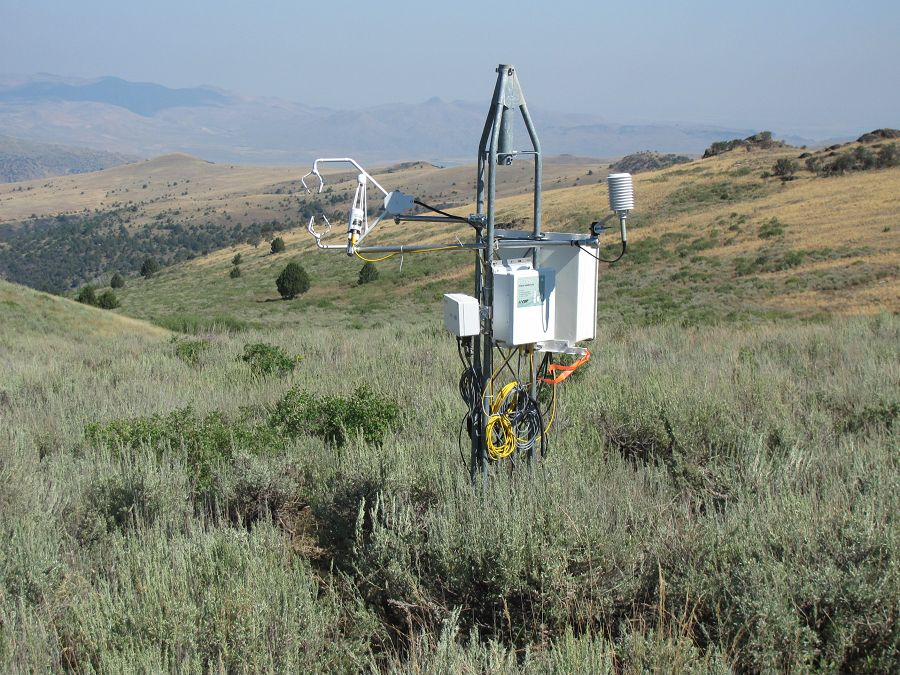
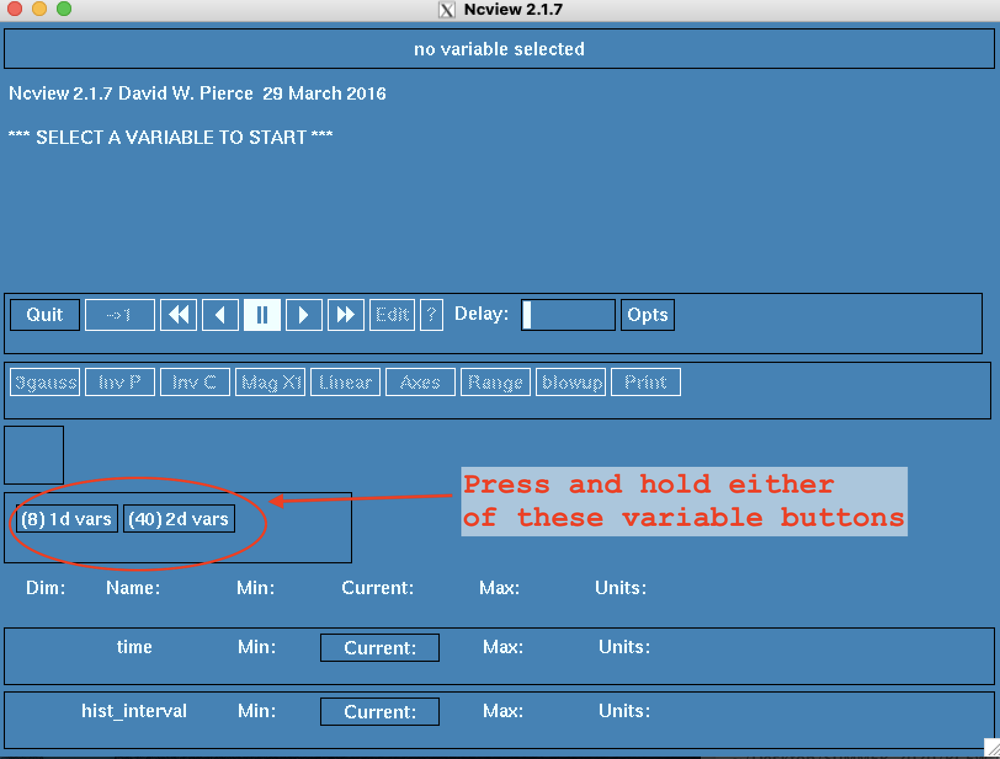
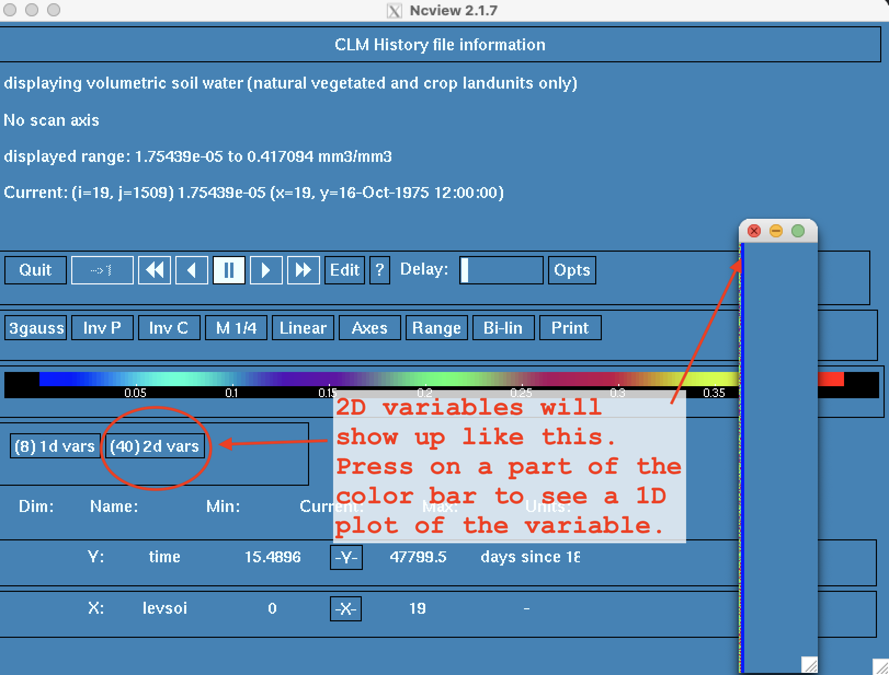
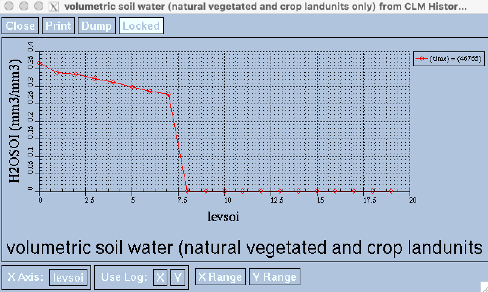

```{r setup, include=FALSE}
knitr::opts_chunk$set(echo = TRUE)
library(kableExtra)
```

## 1. Introduction

The purpose of this technical note is to familiarize a LEAF lab user (or any user) with setting up and running a single point climate simulation at the Reynold's Creek Experimental Watershed (RCEW) using the Community Terrestrial Systems Model (CTSM) with standard climate forcing data or meterological data from one of the AmeriFlux towers on the site. 

In this document, I am assuming that you have a small or large allocation on the National Center for Atmospheric Research's (NCAR) supercomputer Cheyenne. At this time CLM is not ported on the high performance computers (HPC), R2 and Borah, at Boise State, but this is a goal to complete soon. For this note, I am also assuming users have an active NCAR project code, a conversational knowledge of a shell type language (bash, sh, csh, tsh, etc.), can use a text editor such as vim or emacs, and a basic understanding of git and github. 

The genreal outline of this technical note will be as followes:

* First, a little background on Reynold's Creek and CESM.
* Section 2: Setting up the file structure on Cheyenne and cloning CTSM
* Section 3: Running Point CLM (PTCLM) make tools to generate the single point surfacedata files needed for running simulations at the tower site of choice.
* Section 4: Running an accelerated spin up for thw tower site.
* Section 5: Running simulations at your tower site!
* Section 6 Examining model output.
* Section 7: A list of useful links at the end to serve a quick reference list. 

### 1.1 Reynold's Creek Experimental Watershed

Reynold's Creek Experimental Watershed (RCEW), located in southwestern Idaho, was established in 1960 to serve as an "outdoor hydrological laboratory". The RCEW is now a part of the Critical Zone Observatory (CZO). Climate and soil data from RCEW is regularly collected, publically avaiable, and is useful for understanding the dynmaincs of the water, energy, and nutrient cycles of the Great Basin as well as the Interior Pacific Northwest. 

More information on RCEW as a part of the CZO can be found [here](https://czo-archive.criticalzone.org/reynolds/infrastructure/field-area/reynolds-creek-experimental-watershed/) and information about available data and data access can be found [here](https://www.ars.usda.gov/pacific-west-area/boise-id/northwest-watershed-research-center/docs/reynolds-creek-experimental-watershed-data/).

```{r clm_fig01, echo=FALSE, eval=TRUE, fig.cap="The Eddy covariance tower at Reynold's Mountain East"}

```

### 1.2 The Community Earth Systems Model (CESM) and the Community Terrestrial Systems Model (CTSM)

The Community Earth Systems Model [CESM](https://www.cesm.ucar.edu/) was created at NCAR in 1983 and has been in use with continual updates ever since. CESM is a global atmosphere model developed to understand and predict Earth's climate. More history about the development of CESM can be found [here](https://www.cesm.ucar.edu/about/?ref=hp).

The Community Terrestrial Systems Model [CTSM](https://www.cesm.ucar.edu/models/cesm2/land/) or [CLM](https://www.cesm.ucar.edu/models/clm/) is the land model componentof the CESM. Often, one may see or hear CTSM refered to as CLM (Community Land Model). Technically, CLM is a specific component to the CTSM, but the terms are often used interchangably. CLM is used for examining the biophysical and biogeochemical processes of the Earth's terrestrial systems. CLM contains various submodel options such as the as the river routing or the dynamic vegetation components. I highly recommend the [overview]() as well as some of the powerpoints and [tutorials](https://www.cgd.ucar.edu/events/2019/ctsm/) from the [github page](https://github.com/ESCOMP/CTSM/wiki/Model-Tutorials) for a more in depth overview. Additionally, the techinal documentation for CLM version 5.0 can be found [here](https://escomp.github.io/ctsm-docs/versions/release-clm5.0/html/tech_note/index.html).

Instructions for this tech note have been edited and aggregated from the [CLM5.0 User's guide](https://escomp.github.io/ctsm-docs/versions/release-clm5.0/html/users_guide/index.html) specifically section 1.7 and the [CLM4.5 User's Guide](https://www.cesm.ucar.edu/models/cesm1.2/clm/models/lnd/clm/doc/UsersGuide/f101.html), specifically Chapter 5.  


## 2. File Structure and Cloning CTSM

### 2.1 File Structure

If you do not currently have a git working directory set up already on Cheyenne, do so now. It is a best practice to keep projects in their own work directory within this git working directory. 

```{bash set_dir, echo=TRUE, eval=FALSE}
cd /glade/work/$USER/ # go to your work directory on Glade
mkdir git             # create a new folder that will be the parent for future projects using CLM/CTSM
cd git                # go to the newly created git folder
```

### 2.2 Cloning CTSM

From your newly created git folder, clone the CLM/CTSM code. There may be updates to the cloning and set up process in the future. The [ESCOMP/CTSM](https://github.com/ESCOMP/CTSM) github and github [wiki](https://github.com/ESCOMP/CTSM/wiki) page are good references to have bookmarked. See the [Quick Start guide](https://github.com/ESCOMP/CTSM/wiki/CTSM-Quickstart-Guide-for-Users) for more cloning information. 

The following code will point to the latest CTSM release:

```{bash git_clone, echo=TRUE, eval=FALSE}
# Check out the latest release branch and create a new branch for your project

# Here I am cloning the most recent release to a new branch and directory "ctsm-rcew"
git clone -b release-clm5.0 https://github.com/ESCOMP/CTSM.git ctsm_rcew 

# Go to the newly created directory
# A new directory should have been created for your project
cd ctsm_rcew

# Check to see the branches you have now created. There should be a master (or main) as well as a ctsm_rcew branch. The ctsm_rcew branch should have a star next to it meaning that is the active branch or branch you are working in.
git branch   

# If no new branch, create your own.
git checkout -b ctsm_rcew
# Explore the contents of the new directory
ls   
```

Notice that there is a folder within your project direcotry named manage_externals. This contains a very important script, checkout_externals, which downloads all of the components required for building and running CTSM. These include: CLM (land model component), CISM (sea-ice component), RTM (river routing component), MOSART (river routing component), CIME (contains scripts and tools for running CESM), CMEPS (Earth prediction option of CIME), FATES (dynamic vegetation option of CLM), and PTCLM (point simulation option of CLM). More information about checkout_externals can be found in the README_EXTERNALS.rst file in your project folder. 

To checkout the externals:

```{bash checkout_externals, echo=TRUE, eval=FALSE}
./manage_externals/checkout_externals
```

It is also a good idea to create separate folders for different projects in your git directory. You can either re-clone ctsm for each proect or do a recursive copy of another project.

For example, I have several projects that live in my git folder.

```{bash git_folder, echo=TRUE, eval=FALSE}
cd /glade/work/katiem/git
ls
> ctsm  ctsm_py  ctsm_sits ctsm_rcew
```


## 3. Set Up for Point Simulations (PTCLM)

The **P**oin**T** **CLM** runs through the steps for creating single point domain and surface data files (link to html for single point and region surface data file generation). PTCLM is a simpler way to create these files specifically for Ameriflux tower sites. The file PTCLMmkdata runs the tools to get datasets set up, and copies them to a location you can use, including the changes needed for a case to use the dataset with namelist and XML changes. There are a few steps you will need to take before you can run the PTCLMmkdata script. For more information on the PTCLMmkdata script see the README file here: 
$CTSMROOT/tools/PTCLM/

*Note* you will setup the **CTSMROOT** in the next code block. 

### 3.1 Site Specific Data

**First**, you will need to add tower site specific data to your location of interest. For more information see the CLM5.0 User's Guide [Adding PTCLM site data](https://escomp.github.io/ctsm-docs/versions/release-clm5.0/html/users_guide/running-PTCLM/adding-ptclm-site-data.html). Go to CTSMROOT/tools/PTCLM/PTCLM_sitedata. 

```{bash, site_data, echo=TRUE, eval=FALSE}
# First, set up your "root" environment
CTSMROOT=/glade/work/katiem/git/ctsm_rcew
# Then, change to the PTCLM_sitedata folder
cd $CTSMROOT/tools/PTCLM/PTCLM_sitedata
```

There you will find three different text files. One for site data (PTCLMDATA_sitedata.txt), one for plant functional type data (PTCLMDATA_pftdata.txt), and one for soils data (PTCLMDATA_soildata.txt). 

The **PTCLMDATA_sitedata.txt** contains the following (comma separated) headers: site_code,name,state,lon,lat,elev,startyear,endyear,alignyear,timestep,campaign

* **site_code**: abbreviation for the tower site
* **name**: long name for the tower site, make sure to use ""
* **state**: state where tower site is located, use abbrevation
* **lon**: longitude location of the tower site (decimal degrees)
* **lat**: latitude of the tower site (decimal degrees)
* **elev**: elevation of the tower site (meters)
* **startyear**: year when data collection began
* **endyear**: year when data collection ended
* **alingyear**: currently unused, use *startyear* as a filler
* **timestep**: timestep that data is collected (minutes)
* **campaign**: funding for the site, for example AmeriFlux, Fluxnet-Canada, etc.

For RCEW we will be using the Reynolds Mountain East tower site ([site description](https://ameriflux.lbl.gov/sites/siteinfo/US-Rwe)), so the following information can be added to the **PTCLMDATA_sitedata.txt** using your text editor of choice (I use vim). In general, the site data for each specific tower can be found from the ameriflux.lbl.gov/sites/siteinfo/your-site website. 

US-Rwe,"RCEW Reynolds Mountain East",ID,-116.7591023,43.0653469,2098,2003,2007,2003,30,AmeriFlux

The **PTCLMDATA_soildata.txt** contains the following (comma separated) headers: site_code,soil_depth,n_layers,layer_depth,layer_sand%,layer_clay%

* **site_cade**: abbreviation for the tower site
* **soil_depth**: not currently in use, enter -999 as the value
* **n_layers**: only 1 soil layer is given, enter 1 as the value
* **layer_depth**: not currently in use, enter -999 as the value
* **layer_sand%**: percent sand, used to set the soil texture
* **layer_clay%**: percent clay, used to set the soil texture

Soil data from Reynold's Mountain East was found at the [Dataset for Soil properties of Reynolds Mountain East a subcatchment of Reynolds Creek, Idaho ](https://doi.org/10.18122/B29T3T). For this instance I averaged the sand and clay contents. Soil data for other sites at RCEW can be found at the  [hydroshare website](https://www.hydroshare.org/group/143). 

Add the following information can be added to the **PTCLMDATA_soildata.txt** using your text editor:

US-Rwe,-999,1,-999,36.32,20.92

Within CLM the soil texture (percent sand and clay) is used to determine the soil's thermal and hydraulic properties (see the CLM tech note chapter 6.3 [Soil and Snow Thermal Properties](https://escomp.github.io/ctsm-docs/versions/release-clm5.0/html/tech_note/Soil_Snow_Temperatures/CLM50_Tech_Note_Soil_Snow_Temperatures.html#soil-and-snow-thermal-properties) and chapter 7 [Hydrology](https://escomp.github.io/ctsm-docs/versions/release-clm5.0/html/tech_note/Hydrology/CLM50_Tech_Note_Hydrology.html#).

*Advanced Note:* Soil texture data (%sand, %clay) is very important because the mineral soil hydraulic properties are calculated using only the Clapp-Hornberg formulation, which uses the %sand to determine saturated hydraulic conductivity. The specific Fortran code can be found in the  [FuncPedotranserMod.F90](https://github.com/ESCOMP/CTSM/blob/master/src/main/FuncPedotransferMod.F90). The outputs from this FuncPedotranserMod.F90 are called into other submodules of the CTSM/CLM code, specifically the [SoilStateInitTimeConst.F90](https://github.com/ESCOMP/CTSM/blob/master/src/biogeophys/SoilStateInitTimeConstMod.F90). All of this is quite a rabbit-hole to fall down, but if you want a better understanding of the model as a whole, read the above referenced chapters of the CLM tech note and have a look at the Soil*.F90 code on [github](https://github.com/ESCOMP/CTSM/tree/master/src/biogeophys).


The **PTCLMDATA_pftdata.txt** contains the following (comma separated) headers:
site_code,pft_f1,pft_c1,pft_f2,pft_c2,pft_f3,pft_c3,pft_f4,pft_c4,pft_f5,pft_c5

* **site_cade**: abbreviation for the tower site
* **pft_c1-5**: the index number of a plant functional type, currently PTCLM only supports up to 5 pfts at a site.
* **pft_f1-5**: the fraction (as a percent) of the site covered by the pft

Add the following information can be added to the **PTCLMDATA_pftdata.txt** using your text editor:

US-Rwe,100,9,0,0,0,0,0,0,0,0

Plant data was inferred from the Ameriflux site description [here](https://ameriflux.lbl.gov/sites/siteinfo/US-Rwe). 

The list of pft indexes (or patch types) can be found [here](https://github.com/ESCOMP/CTSM/blob/master/src/main/PatchType.F90):

Make a table of pfts with the acronym and index #
```{r pft_table, echo=FALSE, eval=TRUE}
dt <- read.csv('PFT_index.csv')

dt %>%
  kbl() %>%
  kable_styling()

```


### 3.2 Loading Modules
Modules are software environments for use on Cheyenne. Information on Cheyenne specific modules and software can be found [here](https://www2.cisl.ucar.edu/resources/computational-systems/cheyenne/software) and useful module commands [here](https://www2.cisl.ucar.edu/resources/computational-systems/cheyenne/user-environment/environment-modules#essential_cmds).

You will need to load the appropriate modules in a specific order because some modules are dependent on others, for example a compiler module often needs to be loaded before some of the NCAR specific software modules. 

**NOTE** Depending on if you use miniconda you may or may mot need to load all of the modules if they are already in the miniconda environment. For example, here I do not *module load python/2* because I will activate a python 2 miniconda environment later.

Modules: 

* **ncarenv**: set up default NCAR environments (needed for capability to enter a qinteractive session)
* **intel**: both load intel compilers: C (icc), C++ (icpc), and Fortran (ifort)
* **ncarcompilers**: loads NCAR compiler wrappers, wraps usual serial and parallel compilers to include all the required libraries and header files. *Needs a compiler loaded first (intel/17.0.1 or 18.0.5)
* **nco**: NCO toolkit manipulates and analyzes data stored in netCDF-accessible formats (DAP, HDF4, and HDF5). Uses ncarenv/1.3, gnu/8.3.0, ncarcompilers/0.5.0
* **netcdf**: software libraries and dataformats for NetCDF. *Needs a compiler loaded first (intel/17.0.1 or 18.0.5)
* **ncl**: loads NCAR Command Language (ncl) package.*Needs a compiler loaded first (intel/17.0.1 or 18.0.5)
* **mpt**: The HPE Message Passing Interface (MPI). *Needs a compiler loaded first (intel/17.0.1 18.0.5)
* **esmf_libs**: Makes Earth Systems Model Framework (ESMF) libraries available. Needs a compiler loaded first (intel/17.0.1 or 18.0.5)
* **ncview**: Loads ncview, which is a quick way to visualize outputs. Type ncview file_name.nc to open a graphical user interface (GUI) for data visualization. 
* **python**: optional, version 2 seems to work the best in this case

```{bash ptcml_modload, echo=TRUE, eval=FALSE}
module load ncarenv/1.3 
module load intel/17.0.1 
module load ncarcompilers/0.5.0 
module load nco/4.7.9 
module load netcdf/4.7.3 
module load ncl/6.6.2 
module load mpt/2.22 
module load esmf_libs/7.1.0r 
module load ncview/2.1.7 
# module load python/2.*, optional
```

### 3.3 Running PTCLMmkdata 

Change directory to the PTCLM folder. From there execute the buildtools script. Buildtools will...

```{bash ptcml_folder, echo=TRUE, eval=FALSE}
CTSMROOT=/glade/work/katiem/git/ctsm_rcew
cd $CTSMROOT/tools/PTCLM
./buildtools

## Should see this text.
## Successfully built CLM tools needed to create datasets for PTCLM
```

There is a known issue within the PTCLMmkdata code which will need to be addressed before you can continue on with the process. Use the text editor of your choice to open PTCLMmkdata. In line 552 you will need to remove the "export" command.

```{bash PTCLMmkdata, echo=TRUE, eval=FALSE}
- cmd = "export REGRID_PROC=1; "+mkmapdat_dir+"/mkmapdata.sh --gridfile "+scripgridfile+" --res "+clmres+" --gridtype regional -v > "+mapdir+"/mkmapdata.log";
+ cmd = mkmapdat_dir+"/mkmapdata.sh --gridfile "+scripgridfile+" --res "+clmres+" --gridtype regional -v > "+mapdir+"/mkmapdata.log";
```

Once all of the modules are loaded, the tools are built, and the PTCLMmkdata script is updated, open up a qinteractive session in order to complete the map generation and file creation process. The process can take several hours, so I suggest setting the walltime to 6 hours.

```{bash ptcml_qint, echo=TRUE, eval=FALSE}
qinteractive -X -A UBOI0006 -l walltime=06:00:00
```

Load a python 2 compatible miniconda environment (optional).

```{bash ptclm_py2, echo=TRUE, eval=FALSE}
conda activate python2

## If you do not have miniconda, then make sure to module load python/2
```

After entering the qinteractive environment, you will need to reset environmental variables.
```{bash ptml_setenv, echo=TRUE, eval=FALSE}
CSMDATA=/glade/p/cesm/cseg/inputdata
CTSMROOT=/glade/work/katiem/git/ctsm_rcew
SITE=US-Rwe
```

Next, run the PTCLMsublist
```{bash ptclm_sublist, echo=TRUE, eval=FALSE}
./PTCLMsublist -l $SITE -d $CSMDATA -o --verbose --account=UBOI0003 --mach=cheyenne

## If you do not have miniconda, then make sure to module load python/2
## When you run the PTCLM scripts make sure to have python in the command path
# python PTCLMsublist -l $SITE -d $CSMDATA -o --verbose --account=UBOI0003 --mach=cheyenne
```

PTCLMsublist will output a command to copy and paste into the terminal. It will look something like this...
```{bash ptclm_mkdata, echo=TRUE, eval=FALSE}
./PTCLMmkdata -s US-Rwe -d /glade/p/cesm/cseg/inputdata

## If you do not have miniconda, then make sure to module load python/2
## When you run the PTCLM scripts make sure to have python in the command path
# python PTCLMmkdata -s US-Rwe -d /glade/p/cesm/cseg/inputdata
```

What is this command doing? 
For more information on the PTCLMmkdata script see the README file here: 
$CTSMROOT/tools/PTCLM/

Basically, PTCLMmkdata is a python script that runs through the process of creating the surface data files for a single point. In this case the single point is an Ameriflux tower site.

Again, this process can take a long time. You may need to run this command multiple times. However, once the mapping files are created they will be skipped over if you have to rerun the PTCLMmkdata command. 

### 3.4 Where does my data go?

Running
```{bash data_loc, echo=TRUE, eval=FALSE}
./PTCLMmkdata --help
>...
--mydatadir=MYDATADIR
                        Directory of where to put your data files (files will
                        be under subdirectories for each site) (default: /glad
                        e/work/katiem/git/ctsm_rcew/tools/PTCLM/mydatafiles)
...
```
will show the default data directory. In this case mydatadir = /glade/work/katiem/git/ctsm_rcew/tools/PTCLM/mydatafiles
                        
You can set a different file path as an environmental variable, but I find that the default works fine. 
```{bash ptclm_datadir, echo=TRUE, eval=FALSE}
MYDATADIR=/glade/work/katiem/srfdata/
./PTCLMmkdata -s US-Rwe --mydatadir=$MYDATADIR -d /glade/p/cesm/cseg/inputdata
```

Different folders for each site you run PTCMLmkdata will be found in your data directory (mydatadir). 

The folders will have the following naming convention: 1x1_*site-name*. So for this example, all of the surface and domain files are here:
/glade/work/katiem/git/ctsm_rcew/tools/PTCLM/mydatafiles/1x1_US-Rwe

## 4. Preparation for Simulations

Within this section we will work through the spinup, post spinup, and simulation process. The majority of these instructions are taken from the CTSM 2019 tutorial practical 4 [link](https://www.cgd.ucar.edu/events/2019/ctsm/files/practical4-wieder.pdf). All of the practicals are incredibly useful and can be found [here](https://www.cgd.ucar.edu/events/2019/ctsm/).

### 4.1 Spin Up

When working with soils, one needs to get to a steady state. In this case, the steady state is the equilibrium conditions given the climate forcing data used. One needs to assume a steady state in order to test transient conditions (i.e. hypotheses, changes to soil properties, CO2 scenarios, etc.). Therefore, the first step in the simulation process is to complete an "accelerated" spin up.

Make sure you are in your CTSMROOT (the base directory where "cime" and "components" live). Then change directories to cime/scripts. Within the cime/scripts directory is the create_newcase script. 

```{bash spinup_createnew, echo=TRUE, eval=FALSE}
cd cime/scripts/

./create_newcase --compset 2000_DATM%GSWP3v1_CLM50%BGC_SICE_SOCN_SROF_SGLC_SWAV --res f09_g17 --case /glade/work/katiem/SITS_cases/Rwe1_CLM50spinup_001 --run-unsupported --project UBOI0003
```

In order to create a new case there are 3 required arguments: compset, res, and case. 

The **compset** argument sets the "component set". This specifies set all the model components used in the simulation. For example, this sets the river routing scheme or essentially turns of a model component by using a "stub". For example, many times land only simulations can use the stub sea-ice component. All the compsets can be found [here](https://www.cesm.ucar.edu/models/cesm2/config/compsets.html).

The **res** argument sets the model's resolution. All resolutions are listed [here](https://www.cesm.ucar.edu/models/cesm2/config/grids.html).

The **case** argument sets the case name and directory location. 

The other arguments used here are run-unsupported and project. 

Some compsets are not scientifically supported. If this is the case one must use the  **run-unsupported** flag. The available [compsets](https://www.cesm.ucar.edu/models/cesm2/config/compsets.html) will have a support level.

The **project** argument is where you input your project number so that NCAR can correctly charge compute hours. 

If you are interested in the arguments please see the help documentation by running

```{bash newcase_help, echo=TRUE, eval=FALSE}
./create_newcase --help
```

As an aside, there are four basic steps to setting up and running CTSM simulations.

1. **Create** the **new case**
2. Following some changes to the environment variables, **setup** the case 
3. The **build the model** (sometimes after more changes to environment variables)
4. Once the model is built, **submit** the case to Cheyenne's batch processing system, pbs

More information can be found in [practical 1](https://www.cgd.ucar.edu/events/2019/ctsm/files/practical1-lombardozzi.pdf) from the above mentioned 2019 CTSM tutorial.

Once the new case is created, move into the newly created case directory. Within the case directory you will find the scripts to run the case setup (case.setup), build the model (script), and submit the case to the batch system (case.submit). 

```{bash spinup_cdcase, echo=TRUE, eval=FALSE}
cd /glade/work/katiem/SITS_cases/Rwe1_CLM50spinup_001
```

From here you will update some environmental variables for the case using the command xmlchange. These variables are specific to the machine (Cheyenne). For a list and more information on the component and machine specific variables you can search for, see [this webpage](http://www.cesm.ucar.edu/models/cesm2/settings/2.1.0/drv_input.html). I suggest bookmarking this page!

```{bash env_mach_pes, echo=TRUE, eval=FALSE}
./xmlchange MPILIB=mpi-serial
./xmlchange --file env_mach_pes.xml --id COST_PES --val 36
./xmlchange --file env_mach_pes.xml --id TOTALPES --val 1
./xmlchange --file env_mach_pes.xml --id NTASKS --val 1
./xmlchange --file env_mach_pes.xml --id NTASKS_PER_INST --val 1
./xmlchange --file env_mach_pes.xml --id ROOTPE --val 0
./xmlchange JOB_WALLCLOCK_TIME=06:00:00 # May cause an ERROR
./xmlchange JOB_QUEUE=regular # May cause an ERROR
```

You can also use ./xmlquery to check the current values of the variables.

```{bash xmlquery, echo=TRUE, eval=FALSE}
./xmlquery COST_PES
>	COST_PES: 36
```

After you've updated the above variables, you are now ready to setup the case. The case.setup script lives

```{bash spinup_casesetup, echo=TRUE, eval=FALSE}
# Remember you are still in the case directory

./case.setup

```

Once your case is setup you will update many more variables using the ./xmlchange command. *Note:* you are still in the Rwe1_CLM50spinup_001 case directory. 

```{bash env_run01, echo=TRUE, eval=FALSE}
./xmlchange --file env_run.xml --id CLM_FORCE_COLDSTART --val on
./xmlchange --file env_run.xml --id CLM_NML_USE_CASE --val 1850_control
./xmlchange --file env_run.xml --id DATM_CLMNCEP_YR_START --val 1901
./xmlchange --file env_run.xml --id DATM_CLMNCEP_YR_END --val 1920
./xmlchange --file env_run.xml --id DATM_PRESAERO --val clim_1850
./xmlchange --file env_run.xml --id CCSM_CO2_PPMV --val 284.7
./xmlchange --file env_run.xml --id STOP_OPTION --val nyears
./xmlchange --file env_run.xml --id RUN_REFDATE --val 0001-01-01
./xmlchange --file env_run.xml --id RUN_STARTDATE --val 0001-01-01

# Turn on the accelerated spinup
./xmlchange --file env_run.xml --id CLM_ACCELERATED_SPINUP --val on

# Set the total number of years to run. 
./xmlchange --file env_run.xml --id STOP_N --val 10
# Set the interval (in years) where a restart file will be created.
./xmlchange --file env_run.xml --id REST_N --val 10
# Set the number of times to resubmit
./xmlchange --file env_run.xml --id RESUBMIT --val 50

# This configuration will run for 500 years.
```

A note about STOP_OPTION, STOP_N,and RESUBMIT. These three variables determine the timing of the simulation. STOP_OPTION gives the units of time, for example number of years (nyears). Other options for STOP_OPTION include number of days (ndays), number of months (nmonths), number of hours (nhours), etc. STOP_N is the count of STOP_OPTION. In this case, STOP_OPTION is in number of years, so STOP_N tells the model to run for 10 years. RESUBMIT is very important and tells the model when to resubmit the case. In this case we are resubmitting the 10 year model 50 times, resulting in 500 years total. For a 500 year spinup these component variables could also be set:

* STOP_OPTION = nyears
* STOP_N = 1
* RESUBMIT = 500

REST_N sets the number of restart files created. This is useful if you know you want to restart from a case. In this case a restart file is created for every 10 years. REST_N could also be set to create a restart file every one year or every 100 years. 

Next, you will point to the domain files you created in Section 3. If you'll notice the file paths here (ATM_DOMAIN_PATH, LND_DOMAIN_PATH). It is optional to copy and paste the surface data files created in section 3 to a different directory. If you do not, the ATM_ and LND_DOMAIN_PATH would be /glade/work/katiem/git/ctsm_rcew/tools/PTCLM/mydatafiles/1x1_US-Rwe

```{bash spinup_domain, echo=TRUE, eval=FALSE}

./xmlchange --file env_run.xml --id ATM_DOMAIN_FILE --val domain.lnd.1x1pt_US-Rwe_navy.200721.nc
./xmlchange --file env_run.xml --id ATM_DOMAIN_PATH --val /glade/work/katiem/SITS_data
./xmlchange --file env_run.xml --id LND_DOMAIN_FILE --val domain.lnd.1x1pt_US-Rwe_navy.200721.nc
./xmlchange --file env_run.xml --id LND_DOMAIN_PATH --val /glade/work/katiem/SITS_data

```

Next, you will update the user_nl_clm (the CLM user namelist) file. Namelist files are also used to update model options and input data. There are many other CLM namelist options and definitions that can be found [here](https://www.cesm.ucar.edu/models/cesm2/settings/current/clm5_0_nml.html), but for now you only need to worry about the options listed in the code block below.

You will set the surface data file to the surfdata file you created in Section 3. 

```{bash spinup_clmusernl, echo=TRUE, eval=FALSE}
echo "fsurdat = '/glade/work/katiem/SITS_data/surfdata_1x1pt_US-Rwe_hist_16pfts_Irrig_CMIP6_simyr2000_c200721.nc'" >> user_nl_clm
echo "hist_mfilt = 20" >> user_nl_clm
echo "hist_nhtfrq = -8760" >> user_nl_clm

echo "hist_empty_htapes = .true." >> user_nl_clm
echo "hist_fincl1 = 'TOTECOSYSC', 'TOTECOSYSN', 'TOTSOMC', 'TOTSOMN', 'TOTVEGC', 'TOTVEGN', 'TLAI', 'GPP', 'CPOOL', 'NPP', 'TWS',
'H2OSNO'" >> user_nl_clm

echo "mapalgo = 'nn','nn','nn','nn','nn'" >> user_nl_datm
```

If you have your own climate or atmospheric forcing data to use (for example you want to use the atmospheric data from the flux tower at your site) you can now copy over the user_datm.streams files you created (see [CLM4.5 User's Guide](https://www.cesm.ucar.edu/models/cesm1.2/clm/models/lnd/clm/doc/UsersGuide/x13434.html#AmeriFluxdata). For some reason the link to the same information in the CLM5.0 User's Guide does not work.)

```{bash spinup_ownatmo, echo=TRUE, eval=FALSE}
cp ../Rwe1_CLM50spinup_001/user_datm.streams.txt.* .
```

Double check the your namelist file (user_nl_clm) using your text editor of choice or the  "cat" command.

```{bash sp_checknl, echo=TRUE, eval=FALSE}
vim user_nl_clm

## or...
cat user_nl_clm
```

Now, build and submit the spinup case!

```{bash sp_build-submit, echo=TRUE, eval=FALSE}
qcmd --./case.build

## This may take a few minutes. When complete you should see:
## MODEL BUILD HAS FINISHED SUCCESSFULLY

./case.submit
```

To check on the progress you can see the jobs you've submitting using the qstat command.

```{bash sp_qstat, echo=TRUE, eval=FALSE}
qstat -u katiem  # the -u argument is for user, so really it is qstat -u $USER
```

You can also check your scratch or scratch archive to check on the progress of the spinup case.

```{bash sp_scratch, echo=TRUE, eval=FALSE}
cd /glade/scratch/$USER/archive/$CASE/
ls 

# or...
cd /glade/scratch/$USER/$CASE/run
ls

```

Congratulations! If all went well, you now have a "spunup" case (one .nc file) to work with. 

The output data will be found in your scratch directory. For example, the output data (i.e. history, *hist*, files) from this example would be found in the following directory:

/glade/scratch/katiem/archive/Rwe1_CLM50spinup_001/lnd/hist

The **lnd** refers to the lnd component outputs. If you look at the all the file directories under /glade/scratch/katiem/archive/Rwe1_CLM50spinup_001/ you will see a folder for each of the CTSM components.

### 4.2 Post Spin-Up

Now that we have 500 years of spinup complete, one has the option to build up to whatever more modern year one would like (normally the beginning year of climate forcing data used). Most of the instructions here again come from [Practical 4](https://www.cgd.ucar.edu/events/2019/ctsm/files/practical4-wieder.pdf) of the 2019 CTSM tutorial, specifically slides 45 onward. The general steps are as follows:

1. Create a new case and go to new case directory
2. ./xmlchanges before running case.setup
3. case.setup
4. Many more ./xmlchanges - changes to run from 1850-1901 - and nl changes
5. Build the model
6. Submit case 
7. ./xmlchanges - 1901 - 1980 
8. Remove bin files from scratch case directory
9. Submit case

#### 4.2.1 Create a new case and go to the new case's directory

```{bash post_spin01, echo=TRUE, eval=FALSE}
# Go to the cime scripts direcotry
cd /glade/work/katiem/git/ctsm_sits/cime/scripts

# Create a new case
./create_newcase --compset HIST_DATM%GSWP3v1_CLM50%BGC_SICE_SOCN_SROF_SGLC_SWAV --res
f09_g17 --case /glade/work/katiem/SITS_cases/Rwe1_CLM50postspin001 --run-unsupported --project UBOI0003

# Go to the new case directory
cd /glade/work/katiem/SITS_cases/Rwe1_CLM50postspin001

```

#### 4.2.2 ./xmlchanges before running case.setup

```{bash post_spin02, echo=TRUE, eval=FALSE}
./xmlchange MPILIB=mpi-serial
./xmlchange --file env_mach_pes.xml --id COST_PES --val 36
./xmlchange --file env_mach_pes.xml --id TOTALPES --val 1
./xmlchange --file env_mach_pes.xml --id NTASKS --val 1
./xmlchange --file env_mach_pes.xml --id NTASKS_PER_INST --val 1
./xmlchange --file env_mach_pes.xml --id ROOTPE --val 0
./xmlchange JOB_WALLCLOCK_TIME=06:00:00 # May cause an ERROR
./xmlchange JOB_QUEUE=regular # May cause an ERROR

```

#### 4.2.3 Run case.setup

```{bash post_spin03, echo=TRUE, eval=FALSE}
./case.setup
```

#### 4.2.4 More ./xmlchanges - changes to run from 1850-1901 - and nl changes

```{bash post_spin04, echo=TRUE, eval=FALSE}
./xmlchange --file env_run.xml --id ATM_DOMAIN_FILE --val domain.lnd.1x1pt_US-Rwe_navy.200721.nc
./xmlchange --file env_run.xml --id ATM_DOMAIN_PATH --val /glade/work/katiem/SITS_data
./xmlchange --file env_run.xml --id LND_DOMAIN_FILE --val domain.lnd.1x1pt_US-Rwe_navy.200721.nc
./xmlchange --file env_run.xml --id LND_DOMAIN_PATH --val /glade/work/katiem/SITS_data

#Changes for a 20th century transient (some of these may not be necessary)
./xmlchange CCSM_BGC=CO2A
./xmlchange DATM_PRESAERO=trans_1850-2000
./xmlchange DATM_CO2_TSERIES=20tr
./xmlchange CLM_NML_USE_CASE=20thC_transient
./xmlchange CLM_CO2_TYPE=diagnostic

##Changes to run from 1850-1901 --
./xmlchange DATM_CLMNCEP_YR_ALIGN=1850
./xmlchange RUN_TYPE=startup
./xmlchange CONTINUE_RUN=FALSE
./xmlchange DATM_CLMNCEP_YR_ALIGN=1850
./xmlchange CLM_FORCE_COLDSTART=off
./xmlchange --file env_run.xml --id DATM_CLMNCEP_YR_START --val 1901
./xmlchange --file env_run.xml --id DATM_CLMNCEP_YR_END --val 1920
./xmlchange --file env_run.xml --id STOP_OPTION --val nyears
./xmlchange --file env_run.xml --id STOP_N --val 51
./xmlchange --file env_run.xml --id RUN_REFDATE --val 1850-01-01
./xmlchange --file env_run.xml --id RUN_STARTDATE --val 1850-01-01
./xmlchange --file env_run.xml --id CLM_ACCELERATED_SPINUP --val off
./xmlchange --file env_run.xml --id CLM_FORCE_COLDSTART --val off

##Also, update these variables
./xmlchange --file env_run.xml --id STOP_N --val 1
./xmlchange --file env_run.xml --id REST_N --val 1
./xmlchange --file env_run.xml --id RESUBMIT --val 50
```

Optional, copy in climate data from the flux tower.

```{bash post_spin04.1, echo=TRUE, eval=FALSE}
# Copy user_datm.streams files from your previous case
# cp ../Ha1_CLM50sp_001/user_datm.streams.txt.* .
```

Make updates to the user namelist files.

```{bash post_spin04.2, echo=TRUE, eval=FALSE}
echo "mapalgo = 'nn','nn','nn','nn','nn'" >> user_nl_datm
echo "finidat = '/glade/scratch/katiem/archive/Rwe1_CLM50spinup_004/rest/0501-01-01-00000/Rwe1_CLM50spinup_004.clm2.r.0501-01-01-00000.nc'" >> user_nl_clm
echo "fsurdat = '/glade/work/katiem/SITS_data/surfdata_1x1pt_US-Rwe_hist_16pfts_Irrig_CMIP6_simyr2000_c200721.nc'" >> user_nl_clm

echo "do_transient_crops= .false." >> user_nl_clm
echo "do_transient_pfts = .false." >> user_nl_clm
echo "do_harvest = .false." >> user_nl_clm
echo "use_init_interp = .true." >> user_nl_clm
```

#### 4.2.5 Build the model

```{bash post_spin05, echo=TRUE, eval=FALSE}
qcmd -- ./case.build
```

#### 4.2.6 Submit the Case

```{bash post_spin06, echo=TRUE, eval=FALSE}
./case.submit
```

#### 4.2.7 ./xmlchanges for running from 1901 - 1980 

As a reminder, you should still be in the case directory /glade/work/katiem/SITS_cases/Rwe1_CLM50postspin001

```{bash post_spin07, echo=TRUE, eval=FALSE}
# after 1901 make these changes (I'm assuming in case directory)
./xmlchange STOP_OPTION=nyears
./xmlchange STOP_N=20
./xmlchange DATM_CLMNCEP_YR_ALIGN=1901
./xmlchange DATM_CLMNCEP_YR_START=1901
./xmlchange DATM_CLMNCEP_YR_END=2014
./xmlchange CONTINUE_RUN=TRUE
./xmlchange RESUBMIT=3
```

#### 4.2.8 Remove bin files from scratch case directory

```{bash post_spin08, echo=TRUE, eval=FALSE}
## cd into the case run directory on scratch
cd /glade/scratch/katiem/Rwe1_CLM50postsp_001/run
## remove the bin file
rm Rwe1_CLM50postspin001.datm.rs1.1901-01-01-00000.bin
```

#### 4.2.9 Rebuild the Model and Submit case

```{bash post_spin09, echo=TRUE, eval=FALSE}

cd /glade/work/katiem/SITS_cases/Rwe1_CLM50postspin001

qcmd -- ./case.build

> MODEL BUILD HAS FINISHED SUCCESSFULLY

./case.submit
```

## 5. Setting Up and Running a Case

Now that you've run through a historic run (which, I'm sorry to say, is optional after the spin up), you can work on a new simulation where you could potentially test hypotheses in the future. The general steps are similar to the historic run, but with minor changes.

General Steps:

1. Clone the historic case and move to cloned case directory
2. ./xmlchanges before running case.setup
3. case.setup --reset
4. ./xmlchanges and nl changes
5. Build the case
6. Copy over the rpointer and case files from the original case
7. Copy over the archive output files
8. Submit the case


#### 5.1 Clone the Historic Case

Cloning is fairly straight forward, and is similar to creating a new case. The res and compset arguments are not needed. The case argument is for the new (cloned) case. The clone argument is the path to the case being cloned.

```{bash clone, echo=TRUE, eval=FALSE}
## Change to the cime scripts directory
cd /glade/work/katiem/git/ctsm_sits/cime/scripts/

## Creat the clone
./create_clone --case /glade/work/katiem/SITS_cases/Rwe1_CLM50_clone --clone /glade/work/katiem/SITS_cases/Rwe1_CLM50postspin001 --project UBOI0003

## Move into the cloned case directory
cd /glade/work/katiem/SITS_cases/Rwe1_CLM50_clone
```

#### 5.2 ./xmlchanges before running case.setup

```{bash clone02, echo=TRUE, eval=FALSE}
./xmlchange MPILIB=mpi-serial
./xmlchange --file env_mach_pes.xml --id COST_PES --val 36
./xmlchange --file env_mach_pes.xml --id TOTALPES --val 1
./xmlchange --file env_mach_pes.xml --id NTASKS --val 1
./xmlchange --file env_mach_pes.xml --id NTASKS_PER_INST --val 1
./xmlchange --file env_mach_pes.xml --id ROOTPE --val 0
./xmlchange JOB_WALLCLOCK_TIME=08:00:00 # May cause an ERROR
./xmlchange JOB_QUEUE=regular # May cause an ERROR
```


#### 5.3 case.setup --reset

Why run the reset argument?

```{bash clone03, echo=TRUE, eval=FALSE}
./case.setup --reset
```

#### 5.4 More ./xmlchanges and namelistl changes

```{bash clone04, echo=TRUE, eval=FALSE}
# Complete xml changes and nl changes for history output.
./xmlchange RUN_TYPE=branch
./xmlchange RUN_REFCASE=Rwe1_CLM50histsp_1980_001
./xmlchange RUN_REFDATE=1981-01-01
./xmlchange STOP_OPTION=nyears
./xmlchange STOP_N=10
./xmlchange CONTINUE_RUN=FALSE
./xmlchange RESUBMIT=12
./xmlchange DATM_CLMNCEP_YR_ALIGN=1980
./xmlchange DATM_CLMNCEP_YR_START=1980
./xmlchange DATM_CLMNCEP_YR_END=2009

# Change history output to be monthly
echo "hist_mfilt = 12" >> user_nl_clm 
```

#### 5.5 Build the case

```{bash clone05, echo=TRUE, eval=FALSE}
qcmd -- ./case.build
>MODEL BUILD HAS FINISHED SUCCESSFULLY
```

#### 5.6 Copy over the rpointer and case files from the original case

One thing that is different about this simulation is the reference to 
```{bash clone06, echo=TRUE, eval=FALSE}
## Copy over the rpointer files
cp -avr /glade/scratch/katiem/Rwe1_CLM50histsp_1980_001/run/rpointer.* /glade/scratch/katiem/Rwe1_CLM50histsp_h1e1_005/run/

cp -avr /glade/scratch/katiem/Rwe1_CLM50histsp_1980_001/run/Rwe1_CLM50histsp_1980_001* /glade/scratch/katiem/Rwe1_CLM50histsp_h1e1_005/run/

## Check to see that they copied over correctly
cd /glade/scratch/katiem/Rwe1_CLM50histsp_h1e1_005/run/
ls
```

#### 5.7 Copy over the archive output files

```{bash clone07, echo=TRUE, eval=FALSE}
## Next make a directory in the scratch archive and copy over the original files
cd /glade/scratch/katiem/archive/

mkdir Rwe1_CLM50histsp_h1e1_005

cp -avr /glade/scratch/katiem/archive/Rwe1_CLM50histsp_1980_001/* /glade/scratch/katiem/archive/Rwe1_CLM50histsp_h1e1_005/

## Check to make sure they copied over correctly
cd /glade/scratch/katiem/archive/Rwe1_CLM50histsp_h1e1_005/lnd/hist
ls
```

#### 5.8 Submit the case

```{bash clone08, echo=TRUE, eval=FALSE}
## Change back to the cloned case directory
cd /glade/work/katiem/SITS_cases/Rwe1_CLM50histsp_h1e1_005/

## And submit the case!
./case.submit
```

## 6. Model Outputs

As noted in the above sections, model output (i.e. history files) are located in the scratch archive. Reviewing and visualizing model output is out of scope for this technical note, but you can use the ncview module for quick visualization.

```{bash ncview, echo=TRUE, eval=FALSE}
## Change to the history output directory
cd /glade/scratch/katiem/archive/Rwe1_CLM50postsp_001/lnd/hist

## Check that you have ncview loaded
module list

## If not, load ncview
module load ncview

## Next, look at the output. Use the * to open all .nc files in ncview

ncview Rwe1_CLM50postsp_001*.nc
```

The user interface allows one to quickly view a specific output.

```{r clm_fig02, echo=FALSE, eval=TRUE, fig.cap="ncview graphical user interface (GUI)"}

```

```{r clm_fig03, echo=FALSE, eval=TRUE, fig.cap="ncview GUI for 2D variables"}

```

```{r clm_fig04, echo=FALSE, eval=TRUE, fig.cap="volumetric soil water through soil level at time t"}

```

## 7. Useful References

Reynold's Creek Experimental Watershed (RCEW) as a part of the Critical Zone Observatory [link](https://czo-archive.criticalzone.org/reynolds/infrastructure/field-area/reynolds-creek-experimental-watershed/) 

- Information about available data and data access  [link](https://www.ars.usda.gov/pacific-west-area/boise-id/northwest-watershed-research-center/docs/reynolds-creek-experimental-watershed-data/).

Soil data from Reynold's Mountain East was found at the [link](https://doi.org/10.18122/B29T3T).

Soil data for other sites at RCEW can be found on hydroshare [link](https://www.hydroshare.org/group/143). 

Reynold's Mountain East Ameriflux data [link](https://ameriflux.lbl.gov/sites/siteinfo/US-Rwe)

Coverting Ameriflux data for use with CLM, from CLM4.5 User's Guide  [link](https://www.cesm.ucar.edu/models/cesm1.2/clm/models/lnd/clm/doc/UsersGuide/x13434.html#AmeriFluxdata)

CESM information [link](https://www.cesm.ucar.edu/)

CTSM information [link](https://www.cesm.ucar.edu/models/cesm2/land/) 

CLM information and overview [link](https://www.cesm.ucar.edu/models/clm/)

CTSM 2019 Tutorial and Practicals [link](https://www.cgd.ucar.edu/events/2019/ctsm/) 

- Practical 1 for an introduction to running CLM simulations on Cheyenne [link](https://www.cgd.ucar.edu/events/2019/ctsm/files/practical1-lombardozzi.pdf) 
- Practical 4 in particular to single point and spinup [link](https://www.cgd.ucar.edu/events/2019/ctsm/files/practical4-wieder.pdf)

CTSM github page [link](https://github.com/ESCOMP/CTSM/wiki/Model-Tutorials) 

Techinal documentation for CLM version 5.0 [link](https://escomp.github.io/ctsm-docs/versions/release-clm5.0/html/tech_note/index.html).

CLM5.0 User's Guide [link](https://escomp.github.io/ctsm-docs/versions/release-clm5.0/html/users_guide/index.html) 

CLM4.5 User's Guide [link](https://www.cesm.ucar.edu/models/cesm1.2/clm/models/lnd/clm/doc/UsersGuide/f101.html)

Cheyenne specific modules and software  [link](https://www2.cisl.ucar.edu/resources/computational-systems/cheyenne/software) 

Useful module commands [link](https://www2.cisl.ucar.edu/resources/computational-systems/cheyenne/user-environment/environment-modules#essential_cmds)

CESM compsets [link](https://www.cesm.ucar.edu/models/cesm2/config/compsets.html).

CESM resolutions [link](https://www.cesm.ucar.edu/models/cesm2/config/grids.html).

CESM component variables list and information (also machine specific variables) [link](http://www.cesm.ucar.edu/models/cesm2/settings/2.1.0/drv_input.html).

If you need to restart a simulation [link](https://www.cesm.ucar.edu/models/cesm1.2/cesm/doc/usersguide/x1582.html#running_ccsm_restarts)


